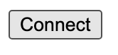

# html-fund-me-fcc

*[⌨️ (12:32:57) Lesson 8: HTML / Javascript Fund Me (Full Stack / Front End)](https://www.youtube.com/watch?v=gyMwXuJrbJQ&t=45177s)*


This is a minimalistic example what you can find in the [metamask docs](https://docs.metamask.io/guide/create-dapp.html#basic-action-part-1).

# Requirements

- [git](https://git-scm.com/book/en/v2/Getting-Started-Installing-Git)
  - You'll know you've installed it right if you can run:
    - `git --version`
- [Metamask](https://metamask.io/)
  - This is a browser extension that lets you interact with the blockchain.
- [Nodejs](https://nodejs.org/en/)
  - You'll know you've installed nodejs right if you can run:
    - `node --version` And get an ouput like: `vx.x.x`
- [Yarn](https://classic.yarnpkg.com/lang/en/docs/install/) instead of `npm`
  - You'll know you've installed yarn right if you can run:
    - `yarn --version` And get an output like: `x.x.x`
    - You might need to install it with npm

Confused? You can run `git checkout nodejs-edition` if you'd like to see this with nodejs. 

## Typescript

For this demo project, we do not have a typescript edition. Please see the NextJS projects for a professional typescript front end. 

### Optional Gitpod

If you can't or don't want to run and install locally, you can work with this repo in Gitpod. If you do this, you can skip the `clone this repo` part.

[](https://gitpod.io/#github.com/PatrickAlphaC/html-fund-me-fcc)

# Quickstart

1. Clone the repo

```
git clone https://github.com/PatrickAlphaC/html-fund-me-fcc
cd html-fund-me-fcc
```

2. Run the file.

You can usually just double click the file to "run it in the browser". Or you can right click the file in your VSCode and run "open with live server".

Optionally:

If you'd like to run with prettier formatting, or don't have a way to run your file in the browser, run:
```
yarn
yarn http-server
```

And you should see a small button that says "connect".



Hit it, and you should see metamask pop up.

# Execute a transaction

If you want to execute a transaction follow this:

Make sure you have the following installed:

1. You'll need to open up a second terminal and run:

```
git clone https://github.com/PatrickAlphaC/hardhat-fund-me-fcc
cd hardhat-fund-me-fcc
yarn
yarn hardhat node
```

This will deploy a sample contract and start a local hardhat blockchain.

2. Update your `constants.js` with the new contract address.

In your `constants.js` file, update the variable `contractAddress` with the address of the deployed "FundMe" contract. You'll see it near the top of the hardhat output.

3. Connect your [metamask](https://metamask.io/) to your local hardhat blockchain.

> **PLEASE USE A METAMASK ACCOUNT THAT ISNT ASSOCIATED WITH ANY REAL MONEY.**
> I usually use a few different browser profiles to separate my metamasks easily.

In the output of the above command, take one of the private key accounts and [import it into your metamask.](https://metamask.zendesk.com/hc/en-us/articles/360015489331-How-to-import-an-Account)

Additionally, add your localhost with chainid 31337 to your metamask.

5. Reserve the front end with `yarn http-server`, input an amount in the text box, and hit `fund` button after connecting

# Thank you!

If you appreciated this, feel free to follow me or donate!

ETH/Polygon/Avalanche/etc Address: 0x9680201d9c93d65a3603d2088d125e955c73BD65

[](https://twitter.com/PatrickAlphaC)
[](https://www.youtube.com/channel/UCn-3f8tw_E1jZvhuHatROwA)
[](https://www.linkedin.com/in/patrickalphac/)
[](https://medium.com/@patrick.collins_58673/)

We need to create a user interface so our user is going to be able interact with our code 

When building Dapps or websites that are connected with the block chain we usually have 2 repos
-one for the smart contracts and the 
-the other for the front end/website
so it's the combination of this 2 that makes it full stack development
that is the smart contract is the back end, then our html/jscript and website stuff is our front end
this is not a front end course

Behind the scenes of web3 websites, to a minimalistic level we can have just a connect and exwecute function
if we check the chrome developer options when we have extensions like metamask adn phantom/solana wallet they automatically get injected to a window object in javascript and in fact in the console, we type in window we can see under the window object for e.g if we type in window.ethereum, which only eists if you have a metamask connected
so if wallet is not connectefd, we still window but window.ethereum is not going to work
so we need to connect our metamask to the website and then check for it using our javascript, and the reason these wallets are needed is cause they have a node and remember that we always need a node to interact with our blockchain
Alchemy and iinfura are third partfy you can use to connect with the block chain but that's for the back end for the front end you usually want to make the customers wallet a main wallet, there are a ton of other wallets but in basic they work the same way

HTML SETUP 
In this section there's going to be raw html/jsvript
then in a later version we are going to be using nodejs/reactjs which is a more modern stack to build our websites


127.0.0.1- this is known as the loop or our local host 

Connecting our wallet to html don't forget anything under the scripts tag is a jscript

A lot of the things we are talking about is in the mmask documentation, if we check it we can see the basics of how to interact with our mmask on html, 
The first thing to do is to check to see if window.ethereum exists
we ccan do this using the if statement
the eth_requestAccounts is a way we try to auto connect our wallet to the site, in older tutprials it might be ethereum.enable()
<!-- 
  <script src="./index.js" type="module"></script> -->
this is for when we create a different document for our jscript and we can just 

FRont end js/ Node js
difference might be a little confusing
in node js we can use the required keyword but in front end js we cant use that, we can later on use the import keyword

there is a line that you run some scripts that transform your code into a code that runs with imports

When we add our scripts to our html, we can save it as type text or what have you, but saving it to type module is better cause that way we can add the modules we'd like to have

when trying to use the terminal for both codes i.e back end and front end, we can open 2 vscodes with their terminal open, or the easier option is for us to open a new terminal on our present code, then cd into the directory and find what we want to find out maybe like the contract address

So since we don't have enough money to runtransactions, we are going to have to import one of the hardhat accounts to the mmask using their private key

Working with mmask we are goling to face a lot of erors while formatting output from RPC, this usual case is cause, we closed our hardhat node and then restarted it so we go to settings and advanced and rexet the acount, byt mostly do thid in a local network and not an actual account

Listening for Events and Completed Transactions
check the index.js

The event loop os when wour codes dont run in the matter they are supposed to, so for this we want to adust our code so 

Input forms
if we want to allow users to input the ammount they want to fund us with, so to do this we need to go back to html and add the form,
but after doining this that measn we have to go back to our index.js and grab the eth amount inputed by the user using this line
  const ethAmount = document.getElementById("ethAmount").value
  Reading from the blockchain
  this is the balance button to track everything we've been doing 